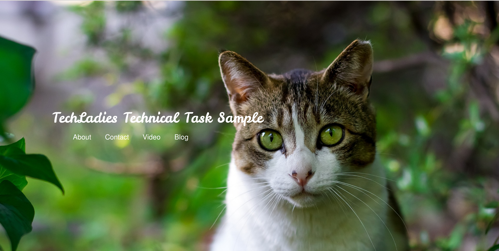
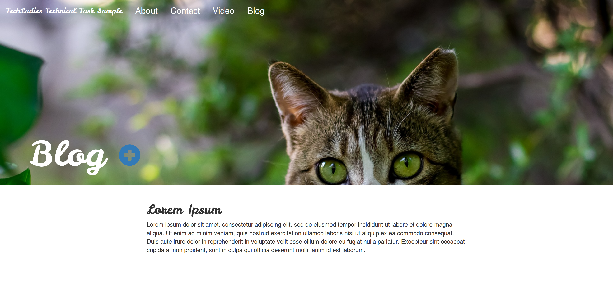
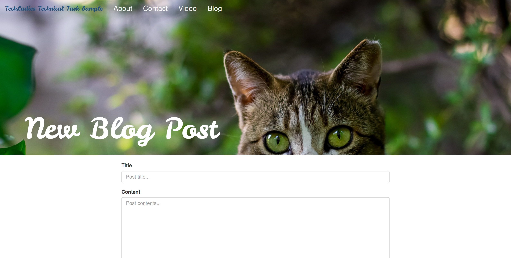

# TechLadies Bootcamp - Technical Task Submission

## 1. Introduction

The TechLadies Bootcamp is a 12-week part-time accelerated learning program designed for women who wish to be professional programmers. You'll be guided by industry experts to create products for non-profit organizations. 30% of the TechLadies Bootcamp graduates found software-related jobs and internships.

Visit [http://www.techladies.co/techladies-bootcamp-3](http://www.techladies.co/techladies-bootcamp-3) for more details.

## 2. The Technical Task

As part of the application process, you will need to complete a technical task. This will help us evaluate your technical capabilities before you can participate in the bootcamp. Don't let the technical task scare you! We are here to help you acquire the skills you need to complete the task with a list of online resources! [See all materials, slides and video recordings here.](https://github.com/TechLadies/prebootcamp-workshops-2017)

***Your task:*** Create a personal website with [Ruby on Rails](http://rubyonrails.org) that has enough visual design to guide users to viewing and using the website. You may use as many [Gems](https://rubygems.org) as you wish to help you create the website.

### The Deets

1. There should be a ***Home*** page with a photo of your choice.
2. There should be a ***About Me*** page where you describe more about yourself in a couple of paragraphs AND embed a YouTube video of yourself telling us why you want to be in the TechLadies Bootcamp. For the camera-shy, you may also embed a short video of your choice (though we prefer cat videos 😻). This video should be between 2 minutes to 4 minutues.
3. There should be a ***Contact Me*** page where you list your:

	- Email address
	- Link to your [GitHub](https://github.com) page (eg. [https://github.com/miccheng](https://github.com/miccheng))

4. There should be a ***Blog*** page where you can include some blog posts. Note: You do not need to ensure that only the admin (you) has the ability to edit, create or delete posts at this point.

	- There should be a form to create new blog posts.
	- Blog posts entries be should be saved to a database.
	- You should also be able to edit & delete existing blog posts.

5. There should be a navigation bar with hyperlinks to all the above pages.

***Hat tip:*** To stand out from the rest, you are highly encourage to not follow one online tutorial to the T. Do read up on multiple resources to understand the concepts or google your way to finding how to accomplish what you want to code.  

---

### For brownie points 🍪 (optional)

So having the 5 items above is sufficient. As a stretch goal, you may try to do these. Note that this is just a reference, please feel free to create and add any features onto your app!

- A [photo carousel](https://www.w3schools.com/bootstrap/bootstrap_carousel.asp) on the ***Home*** page.
- Some photos in your ***About Me*** page.
- A simple contact form on the ***Contact Me*** page. Information submitted through this contact form should be stored in a database.

---

### For even more brownie points 🍪🍪 (totally optional)

Totally unnecessary, but if you wanna show off. 😁 Note that this is just a reference, please feel free to create and add any features onto your app!

- Add a [Facebook](https://developers.facebook.com/products/social-plugins/overview/) or [Twitter](https://dev.twitter.com/web/overview) widget in your ***Contact Me*** page.
- Timeline of your education and career in your ***About Me*** page.
- Having a user login section for the ***Blog*** page to ensure only you can submit the blog post.
- Publish your personal website on [Heroku](https://www.heroku.com).

---

### Sample Mocks

You may find it helpful to refer to these layout mocks when building your website. These are just to give you a visual idea of what you can build and what your final product might look like. *In no way are we expecting you to replicate this or do anything in a similar style (we don't want to limit your creativity!). However, it is also perfectly fine if you choose to do so.*

*Home*

*Blog*

*New Blog Post*

## 3. Submitting Your Entry

1. After you have finished building your personal website, you will need to share the source code with us. You should do so:

	- As a [Git repository](https://git-scm.com) on [GitHub](https://github.com) or [Bitbucket](https://bitbucket.org) (its free!)
	- As a [Zip file](https://en.wikipedia.org/wiki/Zip_(file_format)) on [Dropbox](https://www.dropbox.com) or [Google Drive](http://drive.google.com).

2. Visit [http://www.techladies.co/forms/new](http://www.techladies.co/forms/new) to fill up the submission form. If you have already submitted the first part, do visit [http://www.techladies.co/login](http://www.techladies.co/login) instead.
3. Under section 2, include the URL (web address) of where we can find your file.

## 4. Questions?

If you have any other questions regarding the task, do contact Elisha at elisha@techladies.co. To ask a technical question or get help for bugs you're facing, please [join our Facebook group and ask them there](https://www.facebook.com/groups/techladiescode). 
